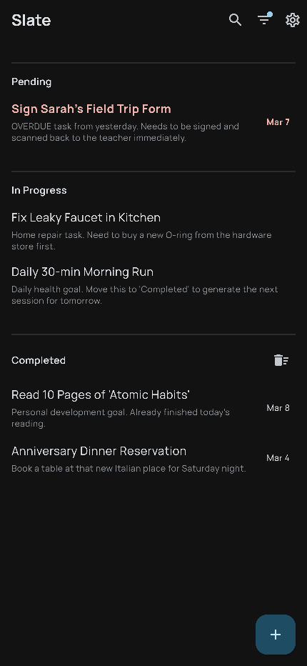

# Slate

Minimalist, local-first task manager designed for focus.



### Features

- **Efficient Workflow**: Swipe to progress through tasks and your day.
- **Markdown Support**: Rich text descriptions with headers, bold, and italics.
- **Interactive Checklists**: Manage sub-tasks directly from the list.
- **Smart Search**: High-visibility highlighting across titles and descriptions.
- **Flexible Scheduling**: Support for recurring tasks and specific due dates.
- **Safety Net**: Restore recently deleted items from the Trash Bin.
- **Photo Attachments**: Attach photos with a built-in interactive viewer.
- **Data Portability**: Export and Restore tasks as JSON files.
- **Private & Fast**: All data stays securely on your device.

### Run Locally

```bash
flutter pub get
flutter gen-l10n
cd ios && pod install && cd .. # for ios
dart run build_runner build --delete-conflicting-outputs
flutter run
```

### Release

- **iOS**: `flutter build ios`
- **Android**: `flutter build apk --release`
- **Web**: `flutter build web --release`

### Versioning

Sync version using the build script:
```bash
./scripts/bump_version.sh
```
